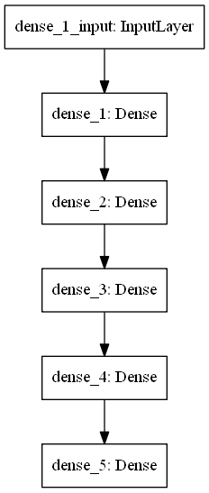
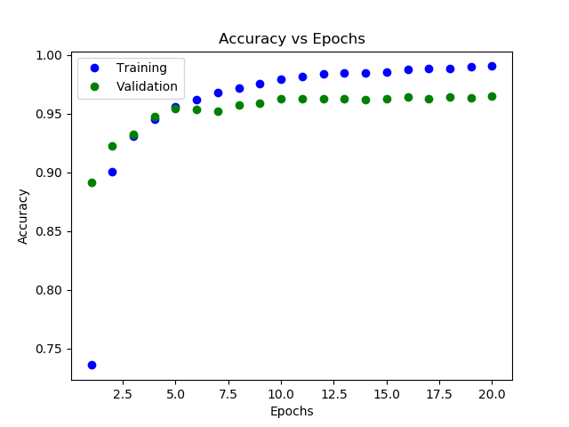
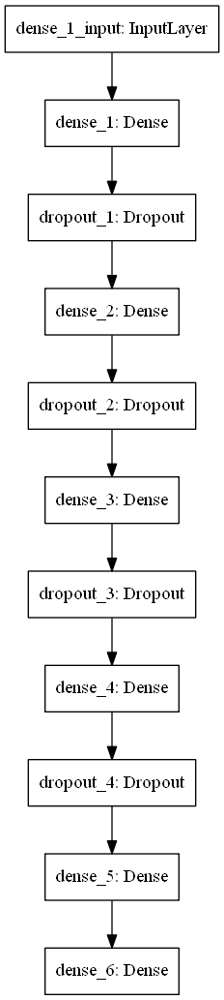
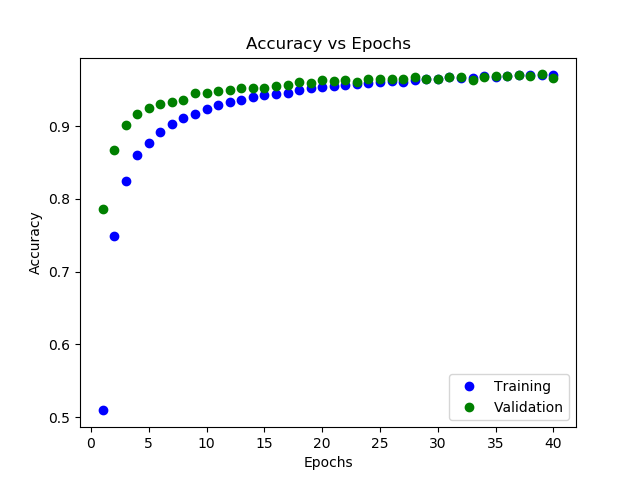
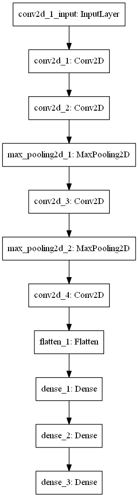
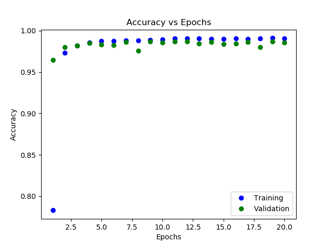
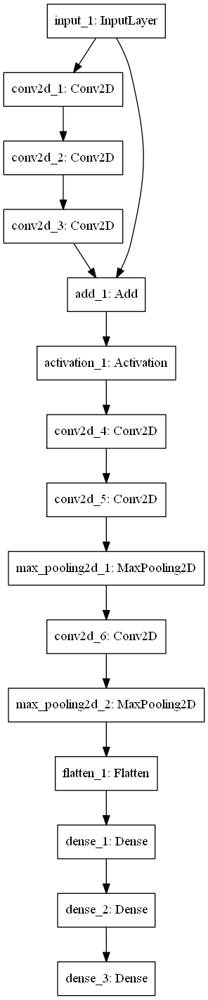
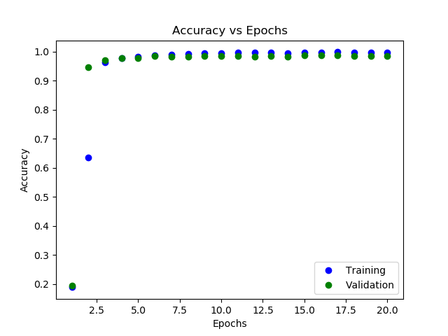

# MNIST Models
This repository contains different models for detecting hand-written digits using the MNIST dataset. The dataset contains 60,000 28x28 images with 10,000 images for testing the accuracy of the model. This repository contains 4 models of neural networks for recognizing handwritten digits: an artificial neural network (ANN), an artificial neural network with regularization (not too different from the ANN), a convolutional neural network (CNN), and a residual network which slightly mimics ResNet50. The model is coded in Python (version 3.6.5) and Keras. The dataset is taken from Keras's datasets (accessible with an import statement). All models were trained on a GeForce GTX 1050Ti, and they all used the Adam optimizer for gradient descent with the default parameters for Beta 1 and Beta 2.

## Data Preprocessing
The preprocessing step was similar in all cases. Much of the preprocessing could have been done automatically by Keras or NumPy, but I chose to manually write the code for practice. I first shuffled the input and output array using a permutation (to keep the mappings the same), and I converted the output array (originally containing numbers 0-9) into one-hot vectors.

## Artificial Neural Network (mnist_ann.py)
### Model Description
This model is a simple artificial neural network. It has 5 layers with 56, 96, 96, 56, and 10 nodes. The first four layers have a ReLU activation while the last layer is a softmax output. The model took 20 epochs to train. Below is a diagram of the model.

### Model Analysis
The model reached an accuracy of around 96.02% on the test set. The model trained fairly quickly as the number of learnable parameters are relatively small. There was a discrepancy between the accuracy of the training set and the validation set, which I believe called for regularization (see the Regularized ANN). Below is a graph of the accuracy on the training and validation sets versus number of epochs.

## Regularized ANN (mnist_ann_regularized.py)
### Model Description
This model builds off of the ANN described previously. It has the same number of nodes in each layer, except it incorporates L2 regularization. The L2 weight is set to 0.0005 for all layers. This model also includes Dropout layers with a 15% chance of each layer dropping out. This model took 40 epochs to train since I felt that adding regularization and more time to train would drastically improve the model's performance on the validation set. Below is a diagram of the model.

### Model Analysis
The model reached an accuracy of around 96.96% on the test set. This was not as high as I had hoped for this model since I allowed it to train longer and added in regularization in the hopes of bringing validation accuracy up. However, this appears to be a limit for my model's structure and the fact that this model is not a convolutional net. As expected, the discrepancy between the performance on the training and validation set was not as much as the un-regularized model. Below is a graph of the accuracy on the training and validation sets versus number of epochs.

## Convolutional Neural Network (mnist_cnn.py)
### Model Description
This model is a big step up from the previously described ANNs. This model has 6 layers (not counting Max Pooling and Flattening) The convolutional part of the net has 16, 32, 64, and 32 layers with a constant filter size of 3x3 and "valid" padding. The model does incorporate Max Pooling with a 2x2 filter and a stride of 2 after the second and 3rd layers. The parameters are flattened and then are fed into an ANN with 128, 64, and finally 10 nodes. The activation for the first 5 layers are ReLU while the activation for the last layer is softmax. All layers have L2 regularization with a weight of 0.005. This model took 20 epochs to train. Below is a diagram of the model.

### Model Analysis
The model reached an accuracy of around 98.76% on the test set. This was a great improvement from the simple ANN, and it is evident why LeNet is a convolutional neural network. There was little discrepancy between the performance on the training and validation sets, and this is expected since there is regularization implemented. Below is a graph of the accuracy on the training and validation sets versus number of epochs.

## Residual Convolutional Neural Network (mnist_residual.py)
### Model Description
This model is similar to the previous CNN except for the single residual block and the increased number of layers. All convolutional layers have a filter size of 3x3, "valid" padding, and a stride of 1. The single residual block contains 3 convolutional layers of size 16, 32, and 16 all with the ReLU activation function. The end of the residual block adds the input with the output of these 3 convolutional layers and applies a ReLU activation function the addition. The residual block is followed by 3 more convolutional layers of size 16, 32, and 16 with ReLU activation. The second and third layers after the residual block have a Max Pooling layer with a filter size of 2x2 and a stride of 2. The outputs are then flattened and are passed into an ANN exactly like the one at the end of the previous CNN. Unlike the previous CNN model, this one does not have regularization. This model took 20 epochs to train. Below is a diagram of the model.

### Model Analysis
This model reached an accuracy of 98.32% on the test set, very similar to the previous CNN. This model took the longest to train by far as it was the deepest and was also a convolutional net. The performance on the training and validation sets were very similar which was a pleasant surprise given that I did not apply any regularization to this model. Below is a graph of the accuracy on the training and validation sets versus number of epochs.

